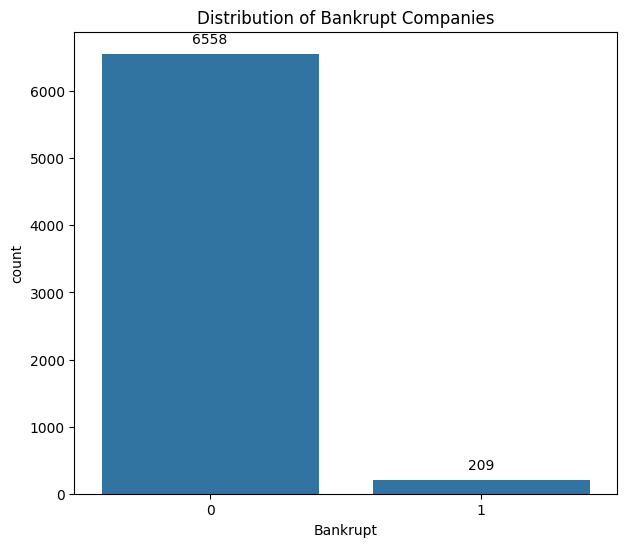

# Dataset Preprocessing for Bankruptcy Prediction

This README provides an overview of the steps for the dataset used to predict whether a company went bankrupt or not. 

## Dataset Description

The dataset contains multiple financial features along with a binary target variable indicating whether a company went bankrupt or not. The features include:

1. **Financial Performance Indicators**: Various ratios and margins such as ROA, operating profit rate, interest rates, cash flow rate, revenue per share, net profit growth rate, etc.
   
2. **Ratios**: Current ratio, quick ratio, debt ratios, borrowing dependency, liabilities to equity ratio, etc.

3. **Asset Management and Turnover Ratios**: Asset turnover, accounts receivable turnover, inventory turnover, fixed assets turnover, etc.

4. **Capital Structure and Cash Flow Ratios**: Cash flow to sales, cash flow to total assets, cash flow to equity, CFO to assets, etc.

5. **Other Financial Metrics**: Gross profit to sales, net income to stockholder's equity, interest coverage ratio, degree of financial leverage, etc.

## Dataset Source
The dataset can be found on Kaggle at the following link: [Company Bankruptcy Prediction](https://www.kaggle.com/datasets/fedesoriano/company-bankruptcy-prediction)

## Preprocessing, Exploring & Predicting

1. **Handling Zero Values**: Data with zeros was handled in multiple ways. In columns where count of zeros was really low (1-20), those rows were dropped. In columns where count of zeros was < 1000, those rows were filled with mean values, and in columns where count of zeros was > 1000, column was dropped to keep data integrity.

2. **Identifying columns with really high correlations to one another**: Columns that could be determined from other columns were removed to decrease the dataset's dimensionality.

3. **Class Balance**: There is 6558 ocurrences of companies that did not go bankrupt and 209 ocurrences that did not go bankrupt, which can make the prediction model biased.

  

5. **Feature Selection**: Target variable is column *Bankrupt?*, and everything else was selected to be fed to the prediction model.

7. **Train-Test Split**: 90% of the dataset was selected for training and 10% of the dataset was sent for testing. Data was split randomly using *random_state*.

8. **Random Forest Classifier**: Random forest was selected as the prediction model because it is a robust learning method that is effective in handling high-dimensional data with complex relationships between features. It aggregates multiple decision trees togther to reduce overfitting and improves generalization performance.

9. **Model Performance**: 
 - **Accuracy**: The model achieved an accuracy of approximately 96.6%. This indicates that the model is able to correctly classify the majority of instances in the dataset. 

 - **ROC-AUC Score**: The ROC-AUC score, which measures the area under the receiver operating characteristic curve, is approximately 0.56. This means that the model's ability to distinguish between positive and negative classes is slightly better than random guessing.

- **Precision, Recall, and F1-Score**: Looking at the classification report, we observe that:
   - Precision for class 0 (non-bankrupt companies) is high (97%), indicating that the majority of instances classified as non-bankrupt are indeed non-bankrupt.
   - Precision for class 1 (bankrupt companies) is also high (100%), indicating that when the model predicts a company as bankrupt, it is correct.
   - Recall for class 0 is perfect (100%), suggesting that the model is able to capture all instances of non-bankrupt companies.
   - Recall for class 1 is relatively low (12%), indicating that the model misses a significant number of bankrupt companies.
   - F1-score for class 0 is high (98%), reflecting a good balance between precision and recall.
   - F1-score for class 1 is low (21%), indicating that the model's performance on identifying bankrupt companies is not as strong.

